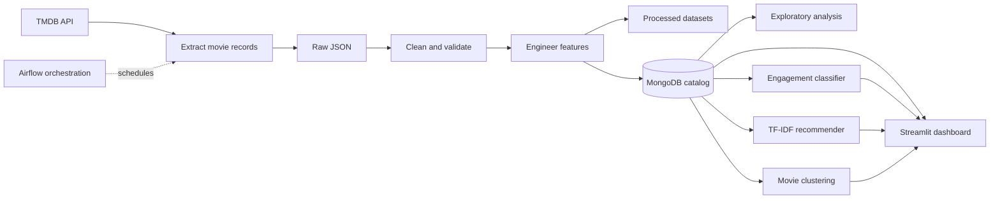

# CineMind

**A movie analytics and discovery platform built with Python, machine learning, NLP, MongoDB, Airflow, and Streamlit.**

CineMind turns movie metadata into an interactive catalog. It collects film records from [The Movie Database (TMDB)](https://www.themoviedb.org/), prepares and enriches the data, and makes it available for exploration, engagement scoring, clustering, and content-based recommendations.

The project brings together a data-engineering workflow and an end-user dashboard: Airflow orchestrates the batch pipeline, MongoDB stores the prepared catalog, and Streamlit presents the analytics and discovery features.

> **Data and model note:** The engagement label is a data-derived proxy based on vote counts. Predictions and similarity scores are exploratory outputs, not guarantees about a film or its audience.

## Contents

- [Highlights](#highlights)
- [How it works](#how-it-works)
- [Core concepts and methods](#core-concepts-and-methods)
- [Technology](#technology)
- [Repository layout](#repository-layout)
- [Getting started](#getting-started)
- [Running the data and model workflows](#running-the-data-and-model-workflows)
- [Data, models, and configuration](#data-models-and-configuration)
- [Limitations and next steps](#limitations-and-next-steps)
- [Project concepts quiz](#project-concepts-quiz)

## Highlights

- **Catalog analytics:** Browse movies and filter by genre, release year, and minimum rating. Review title counts, ratings, release-year and genre distributions, and popularity against ratings. Export the filtered catalog as CSV.
- **Engagement classification:** Select a catalog title to see a predicted engagement class and score from a saved scikit-learn model.
- **Movie clustering:** Build clusters from numeric movie attributes, overviews, genres, and keywords. Explore cluster sizes, summary statistics, a two-dimensional map, and representative titles.
- **Content recommendations:** Find films similar to a selected movie or enter a plot or mood query to retrieve overview-similar titles.
- **Data fallbacks:** The dashboard tries MongoDB first, then local featured, cleaned, and raw data files.
- **Automated workflow:** An Airflow DAG connects extraction, cleaning, feature engineering, MongoDB storage, classification, and clustering.
- **Containerized dashboard:** Docker Compose can start the Streamlit app with MongoDB and a persistent database volume.

## How it works



The Airflow DAG runs the core ETL path in order: extract, clean, engineer features, and store the resulting catalog. Classification and clustering run after the MongoDB load. The Streamlit dashboard reads from MongoDB when it is available and can fall back to local catalog files.

## Core concepts and methods

### 1. Movie data extraction

[`src/extraction.py`](src/extraction.py) calls the TMDB movie-details endpoint for a range of movie IDs. It maps the API response into the project’s catalog fields—such as `movie_id`, `title`, `overview`, `release_date`, `genres`, `keywords`, `budget`, `revenue`, `popularity`, and vote statistics—and writes a JSON document containing both metadata and movie records.

The extractor skips IDs that return HTTP 404 and includes a small delay between requests. The API key is read from the `TMDB_API_KEY` environment variable.

### 2. Cleaning and quality checks

[`src/cleaning.py`](src/cleaning.py) reads the raw JSON into a pandas DataFrame and applies a sequence of transformations:

1. Reports the input shape, missing values, duplicate titles, and absent expected columns.
2. Converts nested TMDB genre and keyword values into lists of names.
3. Removes duplicate rows by `movie_id` and resets the DataFrame index.
4. Parses release dates and coerces numeric columns to numeric types.
5. Fills missing runtime, budget, and revenue values with their column medians when nulls are present.
6. Removes records with non-positive or over-300-minute runtimes, clips ratings to the 0–10 range, and prevents negative budget and revenue values.
7. Writes a CSV and reports column groups for downstream inspection.

These rules are intentionally simple baseline data-preparation choices. Review their effects against the data before using the output for consequential analysis.

### 3. Feature engineering

[`src/feature_eng.py`](src/feature_eng.py) adds analytical features to a movie DataFrame:

| Feature group | Method |
| --- | --- |
| Release date | Parse `release_date` and derive release year, month, decade, and a decade label. |
| Genre and keyword counts | Count the items in each movie’s genre and keyword lists. |
| Duration and budget bands | Use `pandas.cut` to assign categorical ranges. |
| Popularity | Apply `numpy.log1p` to reduce the skew of popularity values. |
| Engagement label | Mark movies at or above the catalog’s 75th-percentile `vote_count` as high engagement. |

The main entry point is `load_features(df)`. The high-engagement label is a relative vote-count threshold, not an independently observed user-engagement outcome.

### 4. Audience-engagement classification

[`src/classification.py`](src/classification.py) builds a supervised binary classifier using the `high_engagement` label. It removes `vote_count` and the target from the predictor DataFrame, converts genres and keywords to text, fills missing overviews, and separates numeric and categorical inputs.

The scikit-learn preprocessing pipeline uses median imputation and standard scaling for numeric columns, most-frequent imputation and one-hot encoding for categorical columns, and TF-IDF features for plot overviews. The project evaluates Logistic Regression, Random Forest, and Linear SVM classifiers. It also runs a Logistic Regression grid search and compares candidate models with stratified cross-validation using accuracy, precision, recall, F1, and ROC-AUC.

The selected model is serialized with its feature metadata using `joblib`. The training script writes `models/airflow/best_model.pkl`; the dashboard checks this path and then `models/best_model.pkl`. The dashboard displays a model output for an existing catalog movie—it does not accept a custom movie form.

### 5. Movie clustering

[`src/clustering.py`](src/clustering.py) prepares numeric fields and TF-IDF representations of overviews, genres, and keywords. It scales numeric features, uses K-Means to group movies, and evaluates candidate cluster counts with the silhouette score. It then reports cluster sizes, numeric profiles, common genres and keywords, and titles nearest to each cluster centroid. `TruncatedSVD` projects the feature space into two dimensions for visualization.

The dashboard also supports clustering on demand. Its interactive implementation combines scaled numeric features with TF-IDF text features, lets the user choose the number of clusters, and shows cluster profiles and a two-dimensional catalog map. It is a separate interactive calculation; clusters are not presented as a pre-trained classifier.

### 6. Content-based recommendations

[`src/nlp.py`](src/nlp.py) provides text-cleaning and TF-IDF helper functions. Its script workflow loads catalog data, cleans overview text, excludes records without usable overviews, fits a `TfidfVectorizer`, and saves the vectorizer, sparse document-term matrix, and aligned movie records.

The dashboard transforms a text query or selected movie overview with the saved vectorizer and ranks catalog movies by cosine similarity. Recommendations are based on textual overview similarity, not collaborative filtering, user histories, or a personalized feedback model.

### 7. Exploratory data analysis

[`src/eda.py`](src/eda.py) uses pandas, Matplotlib, and Seaborn to produce nine charts: rating and popularity distributions, common genres, release years, runtime, budget versus revenue, votes versus popularity, ratings by decade, and numeric correlations. The `run_eda` function writes chart images to `notebooks/eda_figs` by default.

### 8. Dashboard and orchestration

- [`dashboard/app.py`](dashboard/app.py) implements the four-tab Streamlit interface: Overview, Classification, Clusters, and Recommendations. It normalizes catalog fields, caches data and model resources, and presents user-facing messages when data or artifacts are unavailable.
- [`dags/movie_pipeline.py`](dags/movie_pipeline.py) defines the `movie_intelligence_pipeline` DAG, scheduled daily with catchup disabled. It uses PythonOperator tasks to connect extraction, cleaning, feature engineering, MongoDB loading, classification, and clustering.
- [`docker-compose.yml`](docker-compose.yml) describes the dashboard and MongoDB services. MongoDB data is stored in a named Docker volume.
- [`airflow-compose.yaml`](airflow-compose.yaml) and [`airflow.Dockerfile`](airflow.Dockerfile) provide a separate local Airflow stack and application dependencies for DAG execution.

## Technology

| Area | Main tools |
| --- | --- |
| Data acquisition | TMDB API, `requests`, `python-dotenv` |
| Data preparation | Python, pandas, NumPy |
| Machine learning | scikit-learn |
| Text processing and recommendations | scikit-learn TF-IDF, SciPy sparse matrices, cosine similarity |
| Persistence | MongoDB, PyMongo, JSON, CSV, pickle |
| Charts and interface | Matplotlib, Seaborn, Streamlit |
| Workflow scheduling | Apache Airflow |
| Packaging and local services | Docker, Docker Compose |

## Repository layout

```text
.
├── dashboard/
│   └── app.py                 # Streamlit analytics and discovery dashboard
├── dags/
│   └── movie_pipeline.py      # Airflow movie pipeline
├── data/
│   ├── raw/                   # Raw TMDB JSON
│   └── processed/             # Cleaned and featured datasets
├── models/                    # Classifier and recommendation artifacts
├── notebooks/
│   ├── eda_figs/              # Generated EDA charts
│   └── models/                # Notebook-related model outputs
├── src/
│   ├── extraction.py          # TMDB extraction
│   ├── cleaning.py            # Data quality and cleaning
│   ├── feature_eng.py         # Derived features
│   ├── classification.py      # Engagement model training
│   ├── clustering.py          # Movie segmentation
│   ├── nlp.py                 # Text processing and TF-IDF artifacts
│   ├── eda.py                 # Exploratory charts
│   └── connection_db.py       # MongoDB connection
├── quiz/                      # Standalone project-concepts quiz
├── airflow-compose.yaml       # Optional Airflow services
├── docker-compose.yml         # Dashboard and MongoDB services
├── Dockerfile                 # Dashboard image
└── requirements.txt           # Python dependencies
```

## Getting started

### Prerequisites

- Git
- Docker Desktop with Docker Compose for the containerized setup, or Python and pip for a local setup
- A TMDB API key to fetch new source data
- Movie data and model artifacts for all dashboard features; see [Data, models, and configuration](#data-models-and-configuration)

### Run with Docker Compose

Create a `.env` file in the repository root. Keep real credentials out of source control:

```dotenv
TMDB_API_KEY=replace-with-your-tmdb-api-key
MONGO_ROOT_USER=admin
MONGO_ROOT_PASSWORD=replace-with-a-long-random-password
MONGO_DB_NAME=cin-mind
```

Start MongoDB and the Streamlit app from the repository root:

```powershell
docker compose --env-file .env up -d --build mongo app
```

Open [http://localhost:8502](http://localhost:8502). The app container listens on port 8501; Compose publishes it on host port 8502 by default. To stop these services, run:

```powershell
docker compose --env-file .env down
```

The MongoDB catalog is persisted in a named volume. Removing containers with `down` does not remove that volume; remove persistent data only when you intentionally want a fresh database.

### Run Streamlit locally

Create and activate a virtual environment, install the dependencies, and start the dashboard:

```powershell
py -3.12 -m venv .venv
.\.venv\Scripts\Activate.ps1
python -m pip install -r requirements.txt
streamlit run dashboard/app.py
```

The local dashboard uses `MONGODB_URI` when configured. Otherwise, it attempts the local data files described below. Set environment variables in your shell or a root `.env` file as appropriate for your environment.

## Running the data and model workflows

### Fetch raw TMDB data

Set `TMDB_API_KEY` in your environment, then run the extraction module from the repository root:

```powershell
python -m src.extraction
```

The module’s default run requests IDs starting at 1 and writes `data/raw/all_movies.json`. The DAG configures its own ID range and container paths.

### Run the Airflow workflow

The DAG is defined in [`dags/movie_pipeline.py`](dags/movie_pipeline.py) and expects the project’s Airflow services, mounted project directories, MongoDB service, and environment settings. The separate local stack is defined in [`airflow-compose.yaml`](airflow-compose.yaml); configure its required secrets and services before starting it. Once Airflow is running, enable or trigger `movie_intelligence_pipeline` from the Airflow UI. It is scheduled daily and does not backfill prior dates.

The DAG writes its data to `data/raw` and `data/processed` inside the Airflow-mounted project directory. Its classifier artifact is written under `models/airflow`.

### Generate recommendation artifacts

After the MongoDB catalog is populated and reachable, run the TF-IDF artifact builder from the repository root:

```powershell
python -m src.nlp
```

This creates:

- `models/tfidf_vectorizer.pkl`
- `models/movie_tfidf_matrix.npz`
- `models/movies_for_search.pkl`

The movie records and matrix rows must remain aligned. Regenerate all three artifacts together whenever the source catalog or vectorizer configuration changes.

### Generate exploratory charts

The `run_eda` workflow in `src/eda.py` reads the MongoDB-backed catalog, engineers features, and writes chart images beneath `notebooks/eda_figs` by default. MongoDB must be available and populated before running it.

## Data, models, and configuration

### Expected catalog fields

The cleaning health check expects these TMDB-derived fields:

`movie_id`, `title`, `overview`, `release_date`, `runtime`, `original_language`, `genres`, `keywords`, `budget`, `revenue`, `popularity`, `vote_average`, and `vote_count`.

Genre and keyword values are normalized during cleaning. Feature engineering adds date parts, genre and keyword counts, duration and budget categories, log popularity, and the engagement label.

### Dashboard data lookup order

The Streamlit app attempts to load the catalog from:

1. MongoDB database `cin-mind`, collection `cleaned_data` by default.
2. `data/processed/movies_with_features.pkl`.
3. `data/processed/movies_clean.pkl`.
4. `data/raw/all_movies.json`.

MongoDB connection settings are read from environment variables, including `MONGODB_URI`, `MONGO_DB_NAME`, and `MONGO_COLLECTION`. The container Compose configuration supplies a MongoDB URI that resolves the `mongo` service from inside the app container.

### Model artifacts

The classifier tab requires a compatible saved model bundle. The dashboard checks `models/airflow/best_model.pkl` first and then `models/best_model.pkl`. The training workflow writes the Airflow path.

The recommendations tab requires the three TF-IDF artifacts listed above. If model files are missing or incompatible, the dashboard reports the issue in the relevant tab; catalog browsing does not itself generate trained model artifacts.

## Limitations and next steps

- The extractor requests individual movie IDs and uses a simple request delay. API rate limits and robust retries should be monitored for larger runs.
- Cleaning imputes runtime, budget, and revenue with medians and excludes runtimes outside its configured range; these assumptions can affect downstream analyses.
- The engagement target is defined from the 75th percentile of `vote_count`. It is a proxy derived from available catalog data, not a ground-truth audience outcome.
- The classifier code performs a stratified train/test split and cross-validation, but the target threshold is computed in feature engineering before that split. Treat reported evaluation as exploratory until target construction and validation are made strictly leakage-safe.
- TF-IDF recommendations compare movie overview text and do not use user preferences or interaction history.
- Airflow configuration is intended for local development. Review credentials, notification settings, retry behavior, and destructive data-loading behavior before any production deployment.
- Dedicated automated tests are not currently included in the repository.

## Project concepts quiz

Open [`quiz/index.html`](quiz/index.html) directly in a browser. It is a standalone, offline quiz with 30 single- and multiple-select questions, scored explanations, and a final pipeline-design scenario. It does not include Streamlit or Airflow questions.
